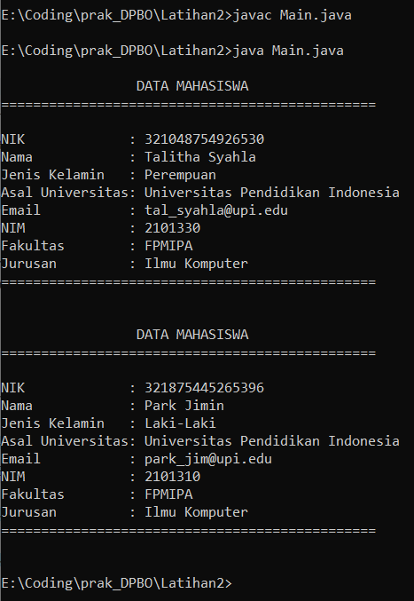

## Janji
Saya Talitha Syahla NIM 2101330 mengerjakan
Soal Latihan 2 dalam mata kuliah Desain Pemrograman Berorientasi Objek untuk keberkahanNya maka saya tidak melakukan 
kecurangan seperti yang telah dispesifikasikan. Aamiin.

# TUGAS LATIHAN 2 DPBO 2023
Buatlah program berbasis OOP menggunakan bahasa pemrograman C++, Java, Python, dan PHP yang mengimplementasikan konsep Multi-level Inheritance  pada kelas - kelas tersebut:
    Mahasiswa: NIM, nama, jenis_kelamin, fakultas, prodi
    Human: NIK, nama, jenis_kelamin
    SivitasAkademik: asal_universitas, email_edu

File README ini berisikan design program, penjelasan alur program, dan dokumentasi saat program dirun/dijalankan.

# Design Program
Design pada program disini menggunakan 3 Class, yaitu:

1) Class Human, yang memiliki atribut:
    - NIK berupa `string`
    - Nama berupa `string`
    - Jenis Kelamin berupa `string`

2) Class SivitasAkademik, yang memiliki atribut:
    - Asal_Universitas berupa `string`
    - Email berupa `string`

3) Class Mahasiswa, yang memiliki atribut:
    - NIM berupa `string`
    - Nama berupa `string`
    - Jenis Kelamin berupa `string`
    - Fakultas berupa `string`
    - Jurusan Kelamin berupa `string`

Ketiga Class di atas memiliki setter dan getternya masing-masing

Pada Class class diatas dilakukan multi-level inheritance dari 

Class Human -> Class SivitasAkademik -> Class Mahasiswa

# Alur Program
Pada program Java, inputannya dilakukan secara hardcode jadi user tidak perlu memasukkan inputan.

# Dokumentasi
### Java

