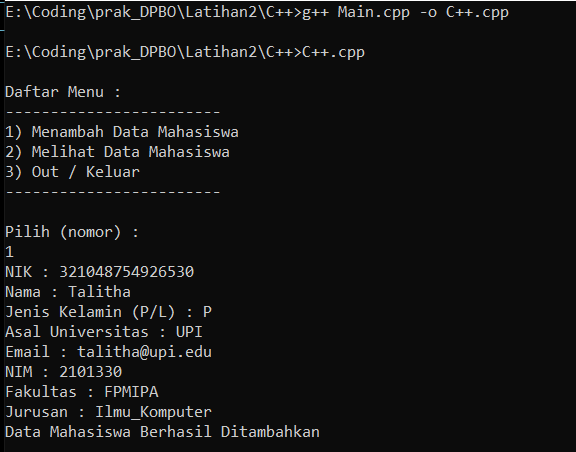

## Janji
Saya Talitha Syahla NIM 2101330 mengerjakan
Soal Latihan 2 dalam mata kuliah Desain Pemrograman Berorientasi Objek untuk keberkahanNya maka saya tidak melakukan 
kecurangan seperti yang telah dispesifikasikan. Aamiin.

# TUGAS LATIHAN 2 DPBO 2023
Buatlah program berbasis OOP menggunakan bahasa pemrograman C++, Java, Python, dan PHP yang mengimplementasikan konsep Multi-level Inheritance  pada kelas - kelas tersebut:

    Mahasiswa: NIM, nama, jenis_kelamin, fakultas, prodi
    Human: NIK, nama, jenis_kelamin
    SivitasAkademik: asal_universitas, email_edu

File README ini berisikan design program, penjelasan alur program, dan dokumentasi saat program dirun/dijalankan.

# Design Program
Design pada program disini menggunakan 3 Class, yaitu:

1) Class Human, Class ini menjadi Super/Base Class yang memiliki atribut:
    - NIK berupa `string`
    - Nama berupa `string`
    - Gender berupa `string`

Class Human ini menjadi Parent Class untuk Class SivitasAkademik. Hal ini dikarenakan semua atribut yang ada pada SivitasAkademik termasuk ke dalam Human, misalnya mahasiswa atau dosen. Namun berbeda dengan manusia (misalnya), dimana tidak semua dari manusia termasuk ke dalam SivitasAkademik.

2) Class SivitasAkademik, Class ini menjadi Derived Class 1 yang memiliki atribut:
    - Asal_Universitas berupa `string`
    - Email berupa `string`

Class ini menjadi Child Class dari Class Human. Hal ini dikarenakan SivitasAkademik merupakan sekelompok manusia/human yang memiliki kegiatan di akademik. Class SivitasAkademik ini juga merupakan Parent Class untuk Class Mahasiswa. 

3) Class Mahasiswa, Class ini menjadi Derived Class 2 yang memiliki atribut:
    - NIM berupa `string`
    - Nama berupa `string`
    - Gender berupa `string`
    - Fakultas berupa `string`
    - Jurusan Kelamin berupa `string`

Class Mahasiswa ini mewarisi Class SivitasAkademik yang berarti Class ini menjadi Child Class dari Class SivitasAkademik.

Ketiga Class di atas memiliki setter dan getternya masing-masing. Terdapat 1 Class tambahan, yaitu Class Crud. Class Crud ini memiliki method untuk menambahData dan melihatData berdasarkan apa yang di input oleh user. Class Crud tambahan ini terdapat pada program C++ dan Python.

## 

# Alur Program
Pada program Java dan PHP, inputannya dilakukan secara hardcode jadi user tidak perlu memasukkan inputan. Namun pada program C++ dan Python user akan diminta untuk memilih pada menu yang tersedia pada program yaitu:
`1) menambahData` untuk memasukkan dan menambahkan data pada list/vector
`2) melihatData` untuk melihat data yang sudah di inputkan sebelumnya oleh user
`3) Out / Keluar` perintah untuk keluar dari menu program

# Dokumentasi
### Java

### C++

